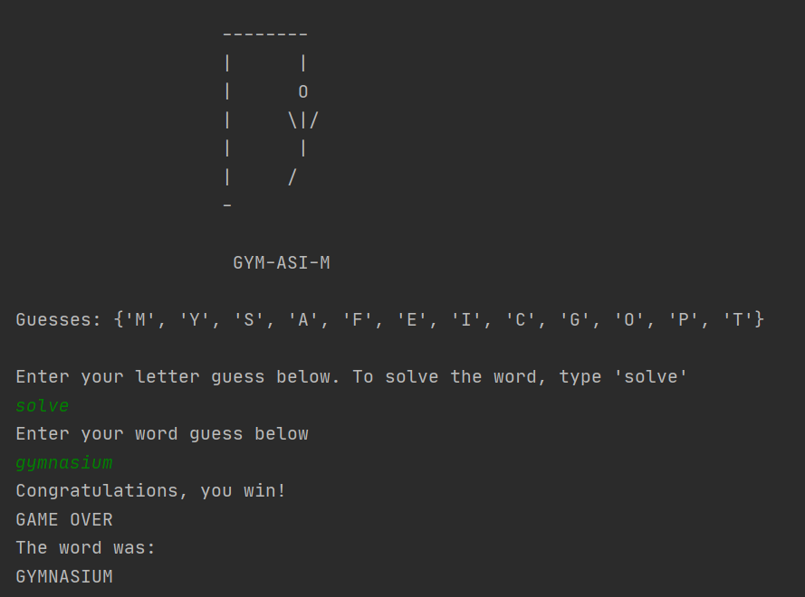

## Welcome to  Alexa's coding central 
### Where I _may_ attempt to put pictures of some **cute animals**
#### Although the turkey looks a _little_ out of place

You can use the [editor on GitHub](https://github.com/houckao/houckao.github.io/edit/master/index.md) to maintain and preview the content for your website in Markdown files.

Whenever you commit to this repository, GitHub Pages will run [Jekyll](https://jekyllrb.com/) to rebuild the pages in your site, from the content in your Markdown files.

https://github.com/houckao/houckao.github.io/issues/1#issue-693785257

### Programming languages I have experience with

#### Python
I choose to learn python because it appeared to be the most applicable coding language for my field of study (Integrated Science and Technology). Python will be helpful within my major as it is a friendly language for beginners and it can adapt to fill many purposes such as data science and software development. This is my primary coding language for the semester. 

#### R and Rstudio 
I am learning this programming for my statistics class, however, this language is extemely usesful for data analysis. Learning a programming language that can import and interpret data will help me later in life to be able to calculate and understand the data - which could be a major advantage to have over others.

### Projects I have worked on 
#### Hangman in python 
This is the project that I spent the most time on this semester. This project is a recreation of the classic childhood game of hangman. I enjoyed creating this game as it has a core structure but you can still modify the game to run the way you want to. In my version I added the features that show guessed letters, allows you to solve for the word, and didn't take any tries for attempting to solve the word. When I first created this project there was a bug in which the program would only reveal one occurace of a letter. After  I solved the bug I got the opportunity to add some more features to my program! 

