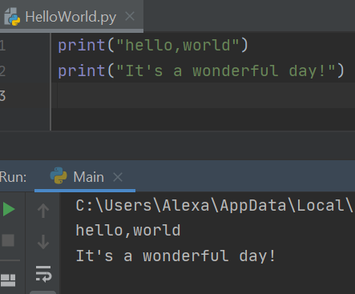
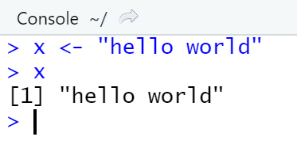
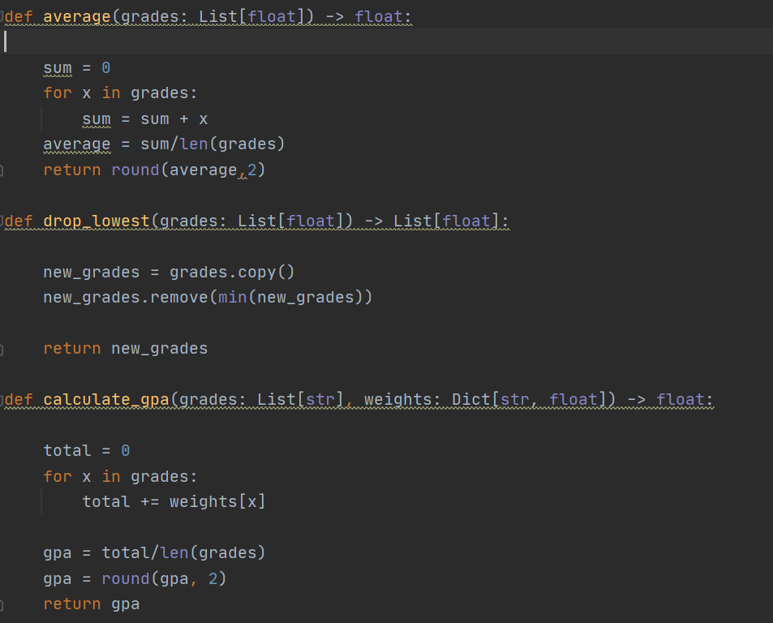

## Welcome to  Alexa's coding central 

### Programming languages I have experience with

#### Python
I choose to learn python because it appeared to be the most applicable coding language for my field of study (Integrated Science and Technology). Python will be helpful within my major as it is a friendly language for beginners and it can adapt to fill many purposes such as data science and software development. This is my primary coding language for the semester. 

#### R and Rstudio 
I am learning this programming for my statistics class, however, this language is extemely usesful for data analysis. Learning a programming language that can import and interpret data will help me later in life to be able to calculate and understand the data - which could be a major advantage to have over others.

### Projects I have worked on 
#### Hangman in python 
This is the project that I spent the most time on this semester. This project is a recreation of the classic childhood game of hangman. I enjoyed creating this game as it has a core structure but you can still modify the game to run the way you want to. In my version I added the features that show guessed letters, allows you to solve for the word, and didn't take any tries for attempting to solve the word. When I first created this project there was a bug in which the program would only reveal one occurace of a letter. After  I solved the bug I got the opportunity to add some more features to my program! 

#### Hello, World
This was the first project I did in coding this semester. I did this both in python and in RStudio when starting out with the languages in order to be able to start figuring out the nuances of the languages I was using.

#### Unit converter and corresponding tests in python 
This project was in order to be able to convert units (in this case miles per gallon to kilometers per meter) and to test the conversion through running a series of tests in python and having them pass. Below is the conversion and the proof of tests passing. To see the full tests go to: https://github.com/houckao/TestingConversions

#### Creating a grade calculator to pass existing tests in python
This project required forking repositories, and then creating three different sections of code (as seen below) in order to pass tests found in the forked repository. To see the tests that the code was created for go to: https://github.com/morphatic/grade-calculator-python/blob/main/grades_calculator_test.py 

