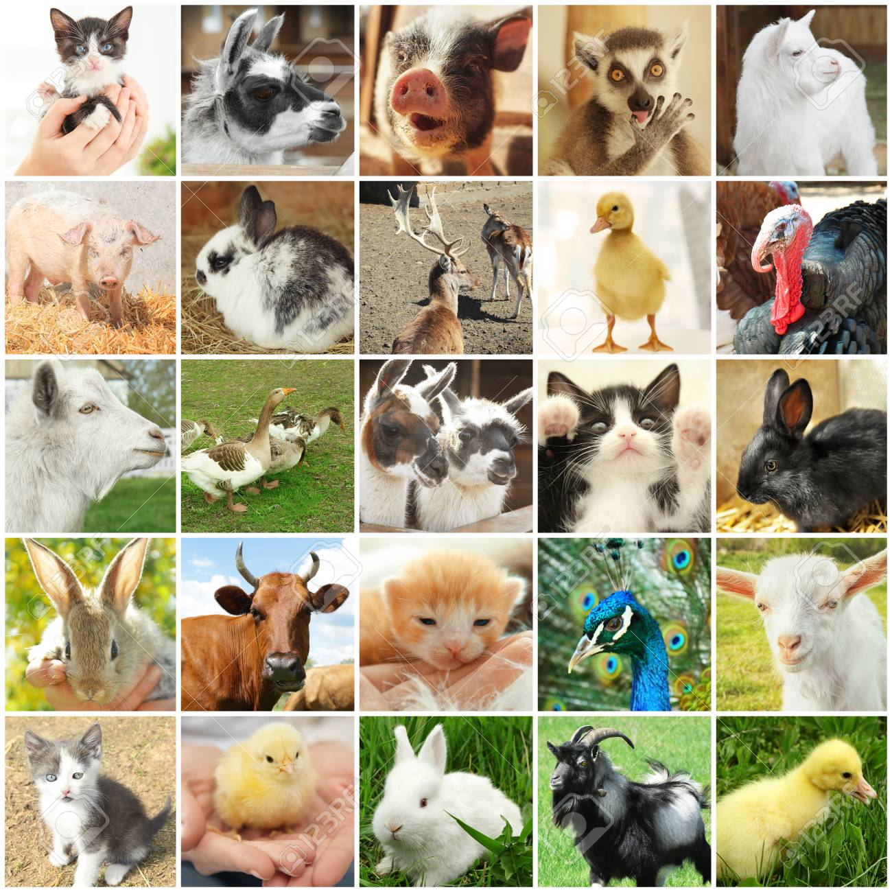

## Welcome to  Alexa's homepage 
### Where I _may_ attempt to put pictures of some **cute animals**
#### Although the turkey looks a _little_ out of place

You can use the [editor on GitHub](https://github.com/houckao/houckao.github.io/edit/master/index.md) to maintain and preview the content for your website in Markdown files.

Whenever you commit to this repository, GitHub Pages will run [Jekyll](https://jekyllrb.com/) to rebuild the pages in your site, from the content in your Markdown files.

https://github.com/houckao/houckao.github.io/issues/1#issue-693785257

### Jekyll Themes

Your Pages site will use the layout and styles from the Jekyll theme you have selected in your [repository settings](https://github.com/houckao/houckao.github.io/settings). The name of this theme is saved in the Jekyll `_config.yml` configuration file.

### Support or Contact

Having trouble with Pages? Check out our [documentation](https://docs.github.com/categories/github-pages-basics/) or [contact support](https://github.com/contact) and we’ll help you sort it out.
